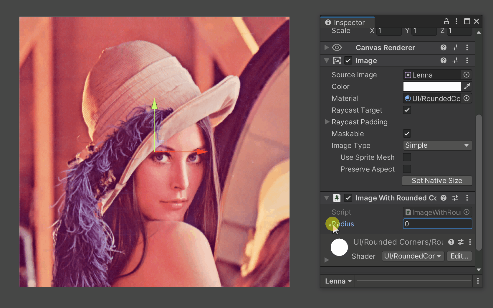
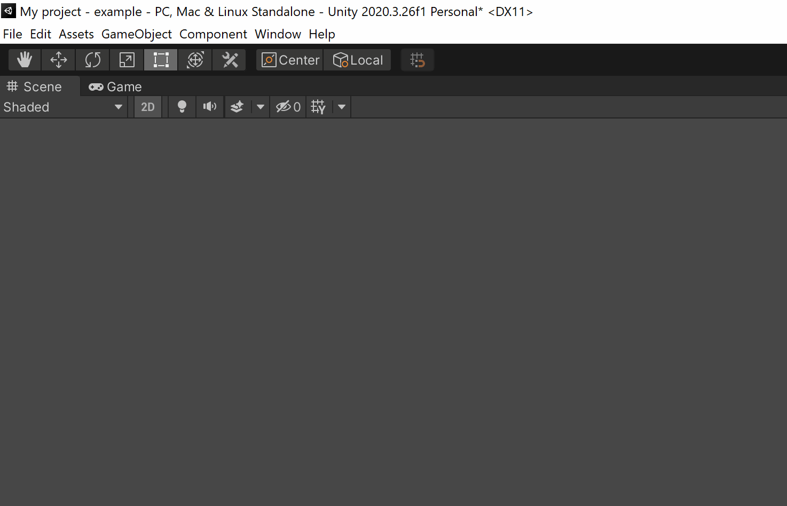
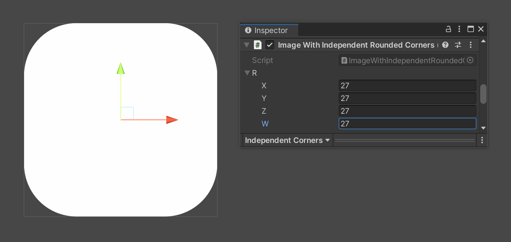

# Unity-UI-Rounded-Corners

These components and shaders allow you to add rounded corners to UI elements!


---



## How to install
### Option 1: Package Manager (Unity 2019.3 and higher)

URL to copypaste: 
```
https://github.com/kirevdokimov/Unity-UI-Rounded-Corners.git
```

### Option 2: Package Manager (Manual)
- Open `%projectname%/Packages/manifest.json`
- Add the following to the dependencies section:
```
"com.nobi.roundedcorners": "https://github.com/kirevdokimov/Unity-UI-Rounded-Corners.git"
```

### Option 3: Unity Package
Get `.unitypackage` from [releases](https://github.com/kirevdokimov/Unity-UI-Rounded-Corners/releases)

## How to use
#### Symmetrical roundness
- Add `ImageWithRoundedCorners` component to a GameObject with an `Image`
- Adjust `Radius` property
#### Certain roundness value for each corner
- Add `ImageWithIndependentRoundedCorners` to a GameObject with an `Image`
- Adjust `r` Vector4 property. Each vector component represent radius, clockwise, starting with top-left corner
#### Important thing
If you need to add or change the image at runtime, call `Validate()` and then `Refresh()` to update the materials.


# Features
## Changing roundness separately or all at once

## Keeps round while resizing

## Better quality than sprites

## Supports Unity Mask

## Supports Tint


# Giving back
If this project has helped you and you'd like to contribute back, you can always [buy me a ☕](https://ko-fi.com/X8X03ULFQ)!
