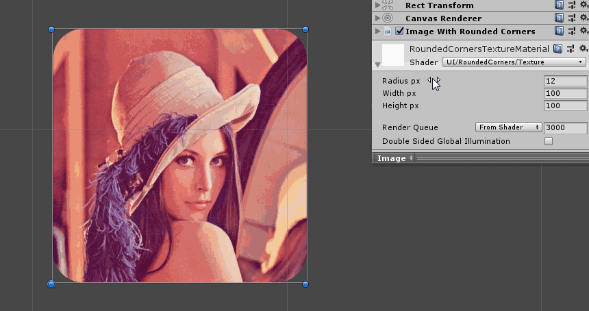
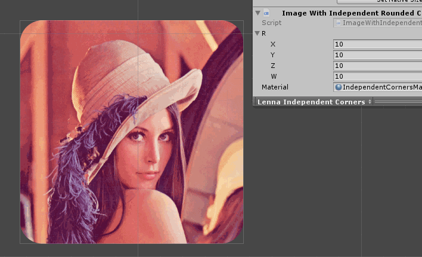
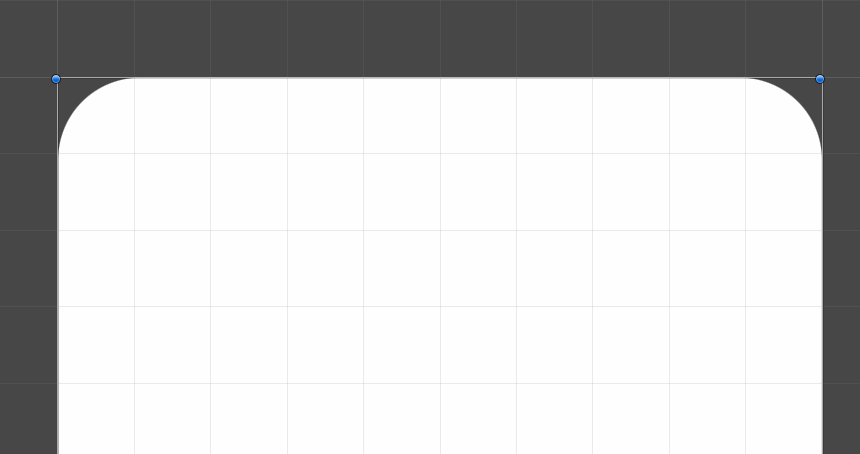
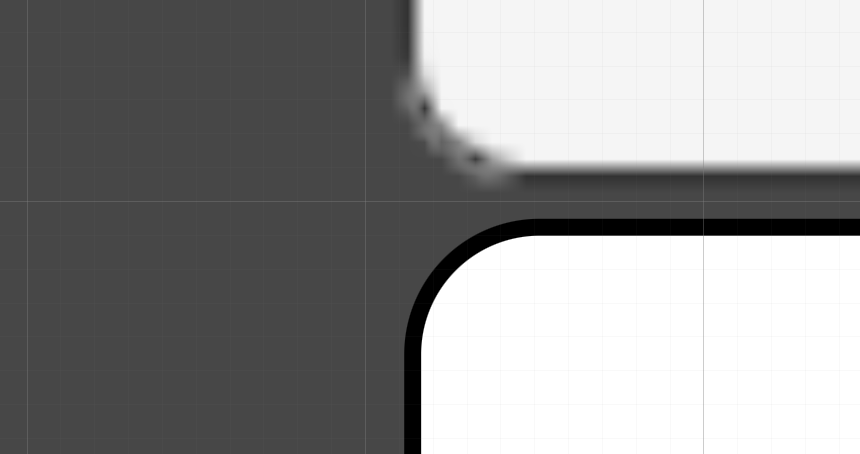
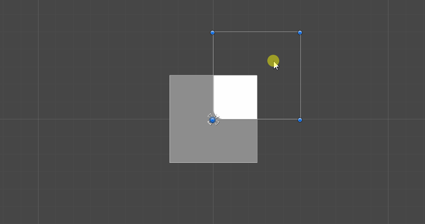
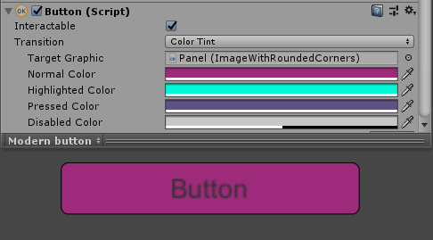

# Unity-UI-Rounded-Corners

These components and shaders allows you to add rounded corners to UI elements!


---



## How to install
### Package Manager
- Open `%projectname%/Packages/manifest.json`
- Add following to dependencies section:
```
"com.nobi.roundedcorners": "https://github.com/Nobinator/Unity-UI-Rounded-Corners.git"
```

### Unity Package
Get `.unitypackage` from [releases](https://github.com/Nobinator/Unity-UI-Rounded-Corners/releases)

## How to use
### Same roundness
- Attach `ImageWithRoundedCorners` to gameobject with `Image`
- Сreate new material 
- Pick `RoundedCorners` shader
- Attach material to `ImageWithRoundedCorners` and `Image`
- Profit
### Separate roundness
- Attach `ImageWithIndependentRoundedCorners` to gameobject with `Image`
- Сreate new material 
- Pick `IndependentRoundedCorners` shader
- Attach material to `ImageWithIndependentRoundedCorners` and `Image`
- Profit

# Features
## Changing roundness separately or all at once

## Keeps round while resizing

## Better quality than sprites

## Supports Unity Mask

## Supports Tint

