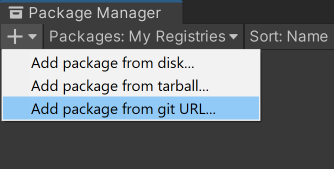
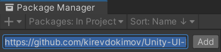

# Unity-UI-Rounded-Corners

These components and shaders allow you to add rounded corners to UI elements!


---


## How to install
### Package Manager UI (Unity 2019.3 and higher)
- In Unity, open the Package Manager window (__Window -> Package Manager__)
- Press the __+__ button in the upper left corner and select __Add package from git URL...__
  
- Paste the following URL: https://github.com/kirevdokimov/Unity-UI-Rounded-Corners.git and click __Add__
  

### Package Manager (Manual)
- Open `%projectname%/Packages/manifest.json`
- Add the following to the dependencies section:
```
"com.nobi.roundedcorners": "https://github.com/kirevdokimov/Unity-UI-Rounded-Corners.git"
```

### Unity Package
Get `.unitypackage` from [releases](https://github.com/kirevdokimov/Unity-UI-Rounded-Corners/releases)

## How to use
### Version 3
#### Same roundness
- Just attach `ImageWithRoundedCorners` to a gameobject with an `Image`
- Profit
#### Separate roundness
- Just attach `ImageWithIndependentRoundedCorners` to a gameobject with an `Image`
- Profit
#### Updates
If you need to add/change the image at runtime, call `Validate()` and/or `Refresh()` to update the materials.
### Version 2 (Legacy)
#### Same roundness
- Attach `ImageWithRoundedCorners` to a gameobject with an `Image`
- Сreate a new material
- Pick the `RoundedCorners` shader
- Attach the material to the `ImageWithRoundedCorners` and the `Image`
- Profit
#### Separate roundness
- Attach `ImageWithIndependentRoundedCorners` to a gameobject with an `Image`
- Сreate a new material
- Pick the `IndependentRoundedCorners` shader
- Attach the material to the `ImageWithIndependentRoundedCorners` and the `Image`
- Profit

# Features
## Changing roundness separately or all at once

## Keeps round while resizing

## Better quality than sprites

## Supports Unity Mask

## Supports Tint


# Performance concerns
Each instance of the script creates a separate material at start-up. If you want to share one material with the same rounding radius between multiple images or have more control over when the materials are created and destroyed, use version 2.

# Giving back
If this project has helped you and you'd like to contribute back, you can always [buy me a ☕](https://ko-fi.com/X8X03ULFQ)!
